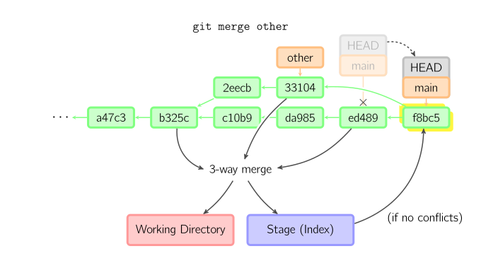

## **An Introduction to Git & GitHub**

<div align="center">  
    
  <br><br>

 **Understanding Version Control in Practice**

*Git "Gud"* with <br>
**Sagar Prakash Barad** <br>
School of Physical Sciences <br>
NISER Bhubaneswar

</div>

### 🔹 Why do we need Git:

> In research, development, and collaboration, understanding your changes and controlling your codebase is essential.
> Git isn’t just a backup tool, it’s a tool to manage your project with calrity.

---


## 🔹 **Git Basics** & 🔸 **Staging Area**

<div align="center">  
    
  <br><br>
</div>


<table style="width:100%">
  <tr>
    <td style="vertical-align:top; width:50%">

### 🧩 Git Overview

* Git is a **Version Control System**.
* Tracks and manages changes across files and time.

#### 📁 File States:

* **Committed**: saved in the Git database.
* **Modified**: changed but not yet staged.
* **Staged**: marked for the next commit via `git add`.

#### 🆔 Commits:

* Each commit has a **unique hash ID**.
* Minimum 4-character prefix if unique in repo.

</td>

<td style="vertical-align:top; width:50%">


### 🗂️ Special Git Files

* **`.gitignore`**:

  * Located at the root of the repo.
  * Tells Git what to ignore.
  * Supports file names, extensions (`*.pyc`), and paths.
  * Keeps unnecessary or sensitive files out of version control.


### 🧷 Staging Area

* Virtual space where changes go after `git add`.
* Allows precise control over **what gets committed**.

</td>
</tr>
</table>

---

## Commands

<div align="center">  
    
  <br>Commits are shown in green as 5-character IDs, and they point to their parents. Branches are shown in orange, and they point to particular commits. The current branch is identified by the special reference HEAD, which is "attached" to that branch. In this image, the five latest commits are shown, with ed489 being the most recent. main (the current branch) points to this commit, while stable (another branch) points to an ancestor of main's commit.<br>
</div>

### Install:<br>
`sudo apt-get install git`
### Set up:<br>
- `git config --global user.name "User Name"` <br>
- `git config --global user.email "email@email.com"`
### Create a New Project:<br>
- `mkdir project`<br>
- `cd project`<br>
- `git init` *(initialise empty git repo in my folder (based on path) aka .git folder)* <br>
- `ls -la` *(check my folder)*


### Check "world status":<br>
`git status`
### Help for each command
`git help <command>`

### Add files
- `git add .` = add all on current branch
- `git add -p <param=file>` = add part of file to staging area, ask for each change (if no param => all files) so we have more control and cleaner commits.
*After any `git add`, we need a `git commit`, either a file or a pattern (e.g. `*.txt`)<br>*
### Delete a file
- `git rm <filename>` = deletes a file, updates git and then commit!<br>
- `git rm --cached <filename>"` = delete a previously tracked file
### Move a file
`git mv <old path> <new path>` *should be followed by:*<br>
`git rm <old path>`<br>
`git add <new path>`

<div align="center">  
    
  <br><br>
</div>

### Check difference
- `git diff`= displays what will be added if i `git add`, so what changed in the folder and hasn't been updated yet
- `git diff <filename>` = displays the alterations of a file (the modified and the commited versions of it)
- `git diff --staged` = displays what has already been added and thus what changed will be recorded
- `git diff HEAD` = displays changes since last commit
### Display history
`git-log` = displays the history, the chronologival order of commits (based on their IDs), who did them, what was their description<br>
`git show <id>` = displays what the <id> commit did = `git log` + `git diff`
  
### Make an [alias](https://medium.com/the-lazy-developer/five-life-changing-git-aliases-e4211c090017)
- `git config --global alias.<aliasname> "command(s)"`
<br>e.g.:<br>
`git config --global alias.lg "log --color --graph --pretty=format: '%(red%h%(green(%cr)%((bold blue)<%an>%(reset' --abbrev -commit"`
- `git config --list` - displays our aliases

### Make archive
`git archive --format=zip -o latest.zip HEAD`

## What does `git commit` do?
- commit a file = create a snapshot of the current world state (files, folders & their contents)
- contains an explanatory message
- automatically stores metadata (creator, date etc)
- has a unique (hex) id number
<br> *e.g.: `git commit -m "Added README file`*

## Combinations
- `git commit -a` = `git add` + `git commit` (not desirable due to lack of control)
- `git pull` = `git fetch` + `git merge` (very useful)


<div align="center">  
    
  <br>When you commit, git creates a new commit object using the files from the stage and sets the parent to the current commit. It then points the current branch to this new commit. In the image below, the current branch is main. Before the command was run, main pointed to ed489. Afterward, a new commit, f0cec, was created, with parent ed489, and then main was moved to the new commit.<br>
</div>

<div align="center">
  <div style="display: inline-block; margin: 0 10px;">
    
  </div>
  <div style="display: inline-block; margin: 0 10px;">
    
  </div>
  <div style="display: inline-block; margin: 0 10px;">
    
  </div>
</div>

<div align="center">  
    
  <br><br>
</div>

### Revert to old commit
`git log`<br>
`git checkout <commit hex id>`

### Cancel not staged changes
`git checkout` = it copies staging area (usually last commit) to out working copy

<div align="center">  
    
  <br><br>
</div>

### Reset
`git reset` - remove all that exists in my staging area by copying them from the most recent commit (basically undoes `git add`)

<div align="center">  
    
  <br><br>
</div>

### Copy a commit to another branch
`git cherry-pick <commit>` = we copy a commit from a point of the graph, we put it on active branch (therefore creating a copy of the selected commit) - new ID, same changes and description!
### Copy changes to new commit
`git revert <commit>` = inverted add/deletes etc. It cancels the commit that has already happened.
### Tags
- `git tag -a <tag>` = adds tag to last commit of current branch
- `git tag -a <tag> <commit>` = add tag to selected commit
- `git tag` = shows all tags in repo
- `git tag -d <tag>` = deletes a tag
### Publish tags
`git push <remote> <tag>` = publishes tag in remote
`git fetch --tags <remote>` = brings all tags from remote
### Serial list of changes
- `git reflog` = all the changes
- `git reflog <branch>` = changes on our branch
- `git reflog --date=relative` = displays changes relative to time

### Prune stale references
 - `git fetch -p`
# Questions

## What is a branch?
It is a version of our code. Branches have a name and are pointing to a commit (there's a different history+past commits depending on our branch, but some commits may be common).
<br>
One branche per feature (the smaller the better) so changes happen to the branch, not the master workflow until the final merge. Afterwards, we merge and delete the branch.

## Commands
- `git branch <name>` = creates the branch, it's an exact duplicate of our current/previous branch (they point to the same commit)
- `git branch` = returns my current branch
- `git checkout <name>` = changes current (`HEAD`), `<name>` points to `HEAD` now
- `git branch -d <name>` = deletes this branch (**NOT** the commits also)
- `git checkout -b <name>` = creates a new branch and makes this new branch as our current working one = `git branch <name>` + `git checkout <name>`
- `git merge <branch>` = merges <branch>'s history with my current branch + try to merge changes in files from both the branches => 2 parents in new commit. *(Afterwards we find the most recent parent of those two parents => commits of the new branch = commits of parent1 + commits of parent2 => updates master, master in new commit - see schema (1))*

<div align="center">  
    
  <br><br>
</div>

*Note: If you make a branch on terminal and want it to show on GitHub, you need to `git push origin branchname` first!*
*Note2: After being done with a branch, `git checkout <productionbranch>`, and then `git merge <tesbranch>` and then `git branch -d <testbranch>` (you can delete the testbranch from GitHub's UX)*

## References to parental nodes
| Symbol  | Meaning                                            |
|----|------------------------------------------------------------|
| ~  | 1 commit behind                                            |
| ^  | the first commited parent                                  |
| ~2 | commit's grandpa (2 commits back based on `^` (if merged)) |
| ^2 | second parent from merge                                   |

e.g. `192a812~2` = 2 commits before commit #192a812, or `HEAD^2`

### Master Branch
- Our default branch after a `git init` command.
- (For most projects) it has a 'current' code
- Usually we create a new branch as a copy of master

## Rewriting History
We can change our commits' sequence, description and changes, but: **you should not rewrite a history in commits that others may pull** <br>
`git commit --amend` = changes most recent commit, add to it the staged stuff.<br>
`git commit --amend --no-edit` = [check here](https://dev.to/lt0mm/comment/eo8)

<div align="center">  
    
  <br><br>
</div>

<div align="center">  
    
  <br><br>
</div>

## Back Merging
When I work on a branch, it is possible that some changes might have happened on master => we need `git merge master` and resolve the conflicts. Or...
- `git rebase` = like `merge` but better, it happens between two branches and changes the base where a branch has been made, rewrites its history (clean). Followed by a clean `pull request`. Generally we merge only for final pull request on each branch.
- `git rebase -i` = dynamic: changes the sequence of commit applies changes, fixes multiple commits or can break a commit to many.
- `git reset <commit>` (usually `git reset HEAD`) = returns current branchto <commit>, cancels in between changes.


## Some GitHub's features
- `fork` = copy a repo to your GitHub account
- `clone` = copy at your PC:<br>
`git clone`<br>`git @ github.com/UserName/git-repo.git`<br>`cd git-repo`
- Your PC repo has the site repo as its remote
- Each repo copy has it's own commits/branches/history (some may be common)
- Each remote has its own URL & name
- `git remote` = shows repo's remotes
- `git remote add <name> <url>`
- `git remote rm <name>`

## Origin
Origin = repo's copy to our GitHub (automatically made when cloning)<br>
If you want to publish your code: `git push origin master` = sends master's local commits to remote's master named origin
If you want to get your code: `git pull origin master` = brings commits at our local master from remote's master named origin

## Intro to PRs
If you want to push to a repo which isn't yours (after forking, cloning, branching, changing and committing our work), we request a pull from the repo's owner (usually at master) so we publish our changes:
- `git push origin feature`
- [create pull request (PR)](https://help.github.com/en/articles/creating-a-pull-request) at repo's owner's GitHub
- Finally, the repo's owner merges, after reviewing them (push anew etc).

## Group Workflow
We have a central repo, the developers fork and do their work.<br>
Latest code = master of central repo.<br>
**NO-ONE PUSHES TO ANY MASTER**: for each change, each person pushes to their fork, PRs to master of control repo, the group reviews and then they merge.<br>
Additionally, each member adds to the central repo an extra remote named 'upstream' (so now each member has 2 remotes: `origin` - their own and `upstream` - central).<br>
From upstream master: everyone pulls to local master & pushes to origin master => Syncing master PRs (All: local & remote).<br>
Each member is a [contributor](https://help.github.com/en/articles/inviting-collaborators-to-a-personal-repository) to the central repo therefore can merge.


## GitHub Issues
Each issue:
- has a unique ID
- is a bug or a task (open/resolved)
- has a description
- has commits

Issues can be opened even by users who are not the repo's owners.
*Note: GitHub allows references to links*

When we locate a bug on a commit, we backtrack to a previous commit where there was no bug and try to find what caused it in the between commits (current=HEAD), or (see (\*)).

### Commands
- `git commit -m "Refactor code for issue #765`<br>
`git commit -m "Closes #765`<br>
or from PR description (similarly)
- `git checkout <commit>` = state detached head can't commit, we need to checkout again into a branch (and check code for some time)
- `git checkout <commit> <file>` = changes file's contains and brings them into commited state (no new commit/no stage)
- (\*)`git bisect`: <br>`git bisect start`<br>`git bisect bad` (HEAD is buggy)<br>`git bisect good <commit>` (<commit> is a known bug free commit).<br>
    *Basically it asks for each commit if the bug exists, we reply with `bisect good/bad`*<br>
   We stop it by using `git bisect reset` (last one). [Check here too](https://git-scm.com/docs/git-bisect).
- `git blame <file>` = marks a file as the culprit<br>

Conflicts can't be automatically merged! Git has changed our file, merges what it can, but the rest is left on us:<br>
Open an editor and look for lines like so: `<<<<<`, `=====`, `>>>>>`<br>
These mark our conflict areas, where we keep all we need and discard what we don't.<br>
Afterwards, we `git add` each file, `git commit` (therefore merge) and all is OK!


## Basic Git Workflow
- edit file (e.g. vim)
- `git add <filename>`
- `git status`
- `git commit -m "Explain what happened"`

## `master` Workflow
- `git remote add origin <giturl>`
- `git checkout master`
- `git pull upstream master`
- `git push origin master`
- `git checkout -b feature`
- `vim && git add && git commit // git add .   , git commit -m "msg"`
- `git push origin feature`
- `hub pull-request -b upstream:master`

## Workflow Overview
- `git init`
- `git commit`
- `git commit`
- `git checkout -b bugfix`
- `git commit`
- `git checkout master`
- `git checkout -b bname`
- `git commit`
- `git commit`
- `git checkout master`
- `git branch -D bname`
- `git chckout -b feature`
...

## Branch Workflow
- `git checkout master`
- `git checkout -b parent2`
- `vim && git add && git commit` (as needed)
- `git checkout master`
- `git merge parent2`
- `git branch -d parent2`

## Merge Workflow
- `git checkout master`
- `git pull upstream master`
- `git push origin master`
- `git checkout feature`
- `git merge master`
- `git push origin feature`
- `hub pull-request`

## Rebase Workflow
- `git checkout master`
- `git pull upstream master`
- `git push origin master`
- `git checkout feature`
- `git rebase master`
- `git push origin feature`
- `hub pull-request`

## Master - Develop Workflow
- `git checkout develop`
- `git pull upstream develop`
- `git push origin develop`
- `git checkout -b feature`
- changes...
- `git push origin feature`
- `hub pull-request -b upstream:develop`

## Release Workflow
- `git checkout master`
- `git pull upstream develop`
- `git push origin develop`
- `git checkout master`
- `git pull upstream master`
- `git merge develop`
- `git tag -a v2.0`
- `git push origin master`
- `git push origin v2.0`
- `git push upstream master, v2.0`


## Git Notes from [LinkedInLearning Course](https://www.linkedin.com/learning/8-git-commands-you-should-know-16027523?u=78611978) by [Ronnie Sheer](https://www.linkedin.com/learning/instructors/ronnie-sheer?u=78611978)

### Stashing

```
git diff                        # shows edits
git stash                       # stashes code
git stash pop                   # removed code from stash
git stash save "edit"           # save a stash named "edit"
git stash list                  # shows stashes w/ index 
git stash apply 0               # applies stashed state with index 0
```

### Staging changes

```
git status                      # shows current state
git commit -am                  # add files & commit at the same time                
                                # less granular control
git add -p                      # accept selectively which
                                # changes you wish
                                # to commit interactively
                                # (type y/n & enter to accept
                                # or decline, respectively)
```

### Mistakes & Fixes

#### Be careful where you push
```
git push                        # quicker
git push <remote> <branch>      # safer
```

#### Undo a commit - NOT pushed
```
git commit -am "something"
git reset --soft HEAD~1         # one commit back
git status                      # now back to staged
```

### Challenge: Rename a commit & move it to another branch
```
git add .
git commit -m "something"

git log                         # shows changes
git reset --soft HEAD~1         # undo commit
git checkout -b new-branch      # create new branch
git commit -m "something again" # redo commit with new name
git checkout -d                 # go back to previous banch
```

### Pre-commit and Pythong
[Check it here](https://pre-commit.com/)

### Amend, Revert
1. Amend: quickly modify a commit before pushing
```
git commit --amend -m "foo bar"
```
2. Revert: creates a new commit where we can undo our action
```
git revert <commit hash>    # optionally edit commit message
git log                     # shows the new state without
                            # losing the erroneous commit
```


# `git pull` after remote forced update
[Source](https://www.scivision.dev/git-pull-after-force-push/)

```bash
# Erase local changes in feat1 and match the remote Git repo.
git switch feat1
git pull --rebase

# To preserve work in feat1
git switch feat1
git fetch
git reset origin/feat1 --soft
```

### New GitHub repo from existing project from local directory

1. In the directory containing the project:
```bash
$ git init
$ git add .
$ git commit 
```
2. On GitHub, create new repo
3. 
```bash
$ git remote add origin git@github.com:username/new_repo
$ git push -u origin main
```

## Bits & Tips
1. *Your branch and origin have diverged and X and Y different commits each respectively*
```
git fetch origin branchName
git reset --hard origin/branchName
```
2. When merge develop to master: NOT SQUASH (keep history of what was merged for PROD)

3. Tags:
```
git fetch --tags (brings tags)
git tag (displays all)
git checkout tags/v1.0 -b v1.0 (creates local branch for this tag)
```

`$ git rerere` = reuse recorded resolution: git remembers how you've resolved a conflict so it resolves it on its own in the future.

`$ git config --global rerere.enabled` or `.gt/rr-cache`

`$ git rerere status` to verify

`$ git rerere diff`

## Sources
1. [This Git Class](https://github.com/dionyziz/git-class)
2. [Lectures on Git from NKUA](https://eclass.uoa.gr/courses/DI352/) (Course name: Software Development for Algorithmic Problems)
3. [Interactive LearnGitBranching](https://learngitbranching.js.org/)
4. [hofmannsven's gist](https://gist.github.com/hofmannsven/6814451)
5. [LinkedInLearning Course](https://www.linkedin.com/learning/8-git-commands-you-should-know-16027523?u=78611978) by [Ronnie Sheer](https://www.linkedin.com/learning/instructors/ronnie-sheer?u=78611978), [exercise code](https://github.com/ZapDos7/git-commands-you-should-know-3021325)
6. Optionally install [ohmyzsh](https://github.com/ohmyzsh/ohmyzsh) for ease of use of git via terminal
7. [LinkedInLearning Course](https://www.linkedin.com/learning/learning-git-and-github-14213624?u=78611978) by [Ray Villalobos](https://www.linkedin.com/learning/instructors/ray-villalobos), [exercise code](https://github.com/LinkedInLearning/learning-git-github-2421501) (*start with branch* `01_02b`)
8. [Notes on rebasing](https://womanonrails.com/git-rebase)
9. [What can go wrong when rebasing?](https://jvns.ca/blog/2023/11/06/rebasing-what-can-go-wrong-/)
10. [Notes on stashing](https://git-scm.com/docs/git-stash)
11. [Notes on cherry-picking](https://www.atlassian.com/git/tutorials/cherry-pick)
12. [The difference between merging & rebasing](https://www.atlassian.com/git/tutorials/merging-vs-rebasing)
13. This [LinkedInLearning course](https://www.linkedin.com/learning/git-essential-training-the-basics?u=78611978) by [Kevin Skoglund](https://www.linkedin.com/learning/instructors/kevin-skoglund)
14. [GitLab HandBook](https://handbook.gitlab.com/handbook/people-group/learning-and-development/gitlab-101/)
15. [jgitver](https://jgitver.github.io/)
16. [This amazingly brief Git tutorial](https://graphite.dev/blog/understanding-git)
17. [Git For Professionals](https://www.freecodecamp.org/news/git-for-professionals/)
18. [Advanced Git Tools](https://www.freecodecamp.org/news/advanced-git-interactive-rebase-cherry-picking-reflog-and-more/)
19. [The  Definitive Guide to `git merge`](https://www.freecodecamp.org/news/the-definitive-guide-to-git-merge/)
20. [Notes for the GitHub Foundations Certification Course](https://www.freecodecamp.org/news/pass-the-github-foundations-certification-course/)
21. [GitLab academy - DevSecOps oriented](https://university.gitlab.com/)

And just Googling issues :)